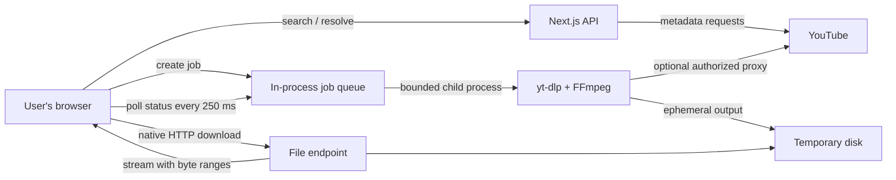

# Phantom

Phantom is a free, web-based interface for finding YouTube media and preparing
video or audio files for a browser download. Users do not install an extension,
desktop application, or local media processor.

> Use Phantom only for media you own, control, or are legally authorized to
> download. The project is independent and is not affiliated with YouTube or
> Google.

## What this repository contains

- A Next.js 16 application and React 19 interface.
- YouTube search, URL, video ID, playlist, and channel resolution through
  `youtubei.js`.
- Format discovery for combined video, adaptive video/audio, and audio-only
  streams.
- A bounded, server-side `yt-dlp` and FFmpeg download queue.
- Real progress across source download, processing, and the final transfer to
  the browser.
- English and Spanish routes with localized metadata, structured data,
  `hreflang`, sitemap entries, social previews, and a web app manifest.
- A production Dockerfile with a health check.

## Architecture



The application is deliberately one deployable service. Next.js serves the
frontend, metadata APIs, job APIs, and final files from the same origin. This
keeps the initial deployment inexpensive and avoids CORS, cross-service
authentication, and object-storage costs.

### Main modules

| Area | Location | Responsibility |
| --- | --- | --- |
| Pages and UI | `app/`, `components/` | Search, results, format selection, queue, and progress |
| Browser queue | `lib/download/manager.ts` | Keeps browser-side job starts bounded |
| Browser job client | `lib/download/worker.ts` | Creates jobs, polls progress, and starts the native download |
| Server job registry | `lib/download/server/jobs.ts` | Global/per-IP limits, process lifecycle, progress parsing, and cleanup |
| Download API | `app/api/download/jobs/` | Create, inspect, cancel, and stream jobs |
| YouTube resolver | `lib/youtube/resolve.ts` | Parses URLs/IDs and resolves searches, videos, playlists, and channels |
| Stream options | `lib/youtube/streams.ts` | Builds video/audio format choices and estimates sizes |
| YouTube session | `lib/youtube/client.ts` | Reuses the Innertube session and applies optional proxy egress |
| Browser state | `stores/download-store.ts` | Queue UI plus persisted preferences |

## Request and download lifecycle

### 1. Resolve media

The browser sends a URL, video ID, playlist, channel, or search term to the
Next.js API. The resolver tries the most specific interpretation first and
falls back to search.

The server reuses one Innertube session and retries once with a fresh session
when it becomes stale. Stream options are cached in memory for five minutes to
reduce repeated upstream requests.

### 2. Select a format

The server returns format selectors, metadata, and estimated sizes, but not
direct Googlevideo URLs. Keeping source URLs on the server prevents the browser
from depending on source CORS behavior and avoids exposing short-lived signed
URLs.

Available choices can include:

- muxed MP4 or WebM streams;
- adaptive video plus audio, merged by FFmpeg;
- source audio in MP4 or WebM;
- MP3 or OGG converted by FFmpeg.

### 3. Create a bounded job

The browser sends only a validated video ID, numeric format selector, supported
container, file name, and estimated size. The server:

- sanitizes the file name;
- rejects unsupported containers and format selectors;
- limits global pending work;
- limits queued/active work per client IP;
- limits concurrent `yt-dlp` processes;
- reserves a bounded aggregate temporary-disk budget;
- applies maximum duration and file-size filters;
- terminates jobs that exceed the configured wall-clock limit;
- creates an isolated temporary directory per job.

### 4. Download and process

`yt-dlp` downloads source fragments and invokes FFmpeg when streams need merging
or audio needs conversion. Both programs run as one child-process group so
cancellation can terminate the complete process tree.

The server parses a machine-readable `yt-dlp` progress template. Multiple
adaptive streams are aggregated into one byte count.

### 5. Transfer to the browser

When the file is ready, the browser starts a normal same-origin download. The
file endpoint:

- streams from disk instead of loading the file into Node.js memory;
- supports single HTTP byte ranges and resumable browser requests;
- sends `Content-Disposition: attachment`;
- disables caching with `private, no-store`;
- records bytes sent during the response.

Files are removed after a completed browser transfer. Interrupted, unserved,
and terminal jobs are retained only long enough to support retry/status
handling, then expire automatically after 30 minutes.

## Progress model

Progress is real, but the phases reserve small portions of the bar so they
remain understandable:

| Range | Meaning |
| ---: | --- |
| 0-2% | Queued and resolving |
| 2-94% | Source streams downloading |
| 95% | FFmpeg merge, remux, or audio conversion |
| 96% | File ready |
| 96-100% | File streaming from the server to the browser |
| 100% | Server finished the browser transfer |

The last 4% measures bytes written by the application response. A browser may
still spend a short time flushing the file to disk after the server reaches
100%.

## Why the design works this way

### No WebSocket

Jobs use small HTTP status requests instead of a permanently open WebSocket.
Polling is easier to operate behind ordinary reverse proxies, survives
temporary network interruptions, and does not leave an unfinished connection
as the only visible request.

### No local application

The browser cannot reliably run `yt-dlp`, spawn FFmpeg, or directly combine
arbitrary source streams. WebAssembly FFmpeg would also move a large memory,
CPU, and bandwidth cost onto the device and often performs poorly on mobile.
Phantom performs this work in a bounded server process and gives the completed
file to the browser's native download manager.

### No browser-to-source media request

The browser never downloads directly from Googlevideo. This avoids source CORS
restrictions, signed URL expiry during client-side processing, and duplicate
downloads when video and audio need to be merged.

### Handling datacenter ASN restrictions

`EWYOUTUBE_PROXY_URL` can send both metadata and media traffic through the same
HTTP(S) egress route. Use a static address or sticky session so a job
does not change source IP halfway through.

This is an operational compatibility option, not a guarantee or a mechanism
for evading access controls. Use only a provider that explicitly permits the
traffic, comply with source-platform terms and applicable law, and expect proxy
bandwidth to be a paid cost.

Cloudflare Tunnel does **not** change this outbound route. Tunnel protects and
publishes inbound traffic; requests from `yt-dlp` to YouTube still leave through
the machine or proxy that runs Phantom.

## Current scaling boundary

The initial architecture intentionally supports **one application replica**:

- job state is an in-memory `Map`;
- active files live on that replica's ephemeral disk;
- status and file requests must reach the process that created the job;
- a restart cancels active jobs and removes their state.

Do not enable horizontal autoscaling without redesigning job ownership. A
multi-replica version needs:

1. a shared queue;
2. a shared status store;
3. object storage for prepared files;
4. signed job/file authorization;
5. cleanup workers and storage lifecycle rules;
6. sticky routing or a split web/worker architecture.

That design is more resilient, but it adds infrastructure and storage/egress
costs. For a free, low-volume utility, one bounded replica is the simpler and
usually cheaper tradeoff.

## Security and abuse controls

The current implementation includes:

- bounded JSON bodies, validated query lengths, and per-endpoint IP rate limits;
- strict video ID, format selector, and container validation;
- sanitized attachment file names;
- global, per-IP, duration, file-size, temporary-disk, and playlist limits;
- child-process cancellation and a forced-kill fallback;
- a hard wall-clock timeout for each child process;
- isolated temporary directories and automatic cleanup;
- proxy credential redaction from returned `yt-dlp` errors;
- a restrictive Content Security Policy and standard browser security headers;
- bounded stream metadata caching with duplicate-request coalescing;
- `nosniff`, private caching, and attachment response headers;
- a container health endpoint and Docker health check.

Before exposing a public instance to untrusted traffic, also add at the edge:

- bot protection for job creation;
- an application-level signed job token or user session;
- request/log correlation and disk, process, queue, and egress monitoring;
- hard account-level spending limits where the host supports them.

The opaque UUID currently acts as the job capability. Anyone who learns a job
ID can inspect, cancel, or fetch that job until it expires. Treat this as a
single-user/small-public-instance implementation, not a multi-tenant security
boundary.

## Local development

### Requirements

- Node.js 22 or newer
- pnpm 10
- Python 3
- current `yt-dlp`
- FFmpeg

```sh
pnpm install
cp .env.example .env.local
pnpm dev
```

Open `http://localhost:3000`.

### Validate a production build

```sh
pnpm check
pnpm start
```

## Configuration

| Variable | Default | Purpose |
| --- | ---: | --- |
| `NEXT_PUBLIC_BASE_URL` | `http://localhost:3000` | Absolute production URL used by SEO metadata |
| `NEXT_PUBLIC_DOWNLOADS_RESTRICTED` | `false` | Build-time switch that disables download actions while retaining search |
| `EWYOUTUBE_PROXY_URL` | unset | Authorized HTTP(S) proxy used for metadata and media egress |
| `DOWNLOAD_MAX_CONCURRENT` | `2` | Simultaneous server-side `yt-dlp` jobs |
| `DOWNLOAD_MAX_PENDING` | `20` | Global queued/active job cap |
| `DOWNLOAD_MAX_JOBS_PER_IP` | `3` | Queued/active job cap per client address |
| `DOWNLOAD_MAX_DURATION_SECONDS` | `14400` | Maximum accepted source duration |
| `DOWNLOAD_MAX_FILESIZE` | `2G` | `yt-dlp` maximum file size |
| `DOWNLOAD_MAX_TEMP_BYTES` | `8589934592` | Aggregate temporary storage reservation cap |
| `DOWNLOAD_JOB_TIMEOUT_SECONDS` | `1800` | Hard wall-clock limit for one download process |
| `DOWNLOAD_CLIENT_IP_HEADER` | unset | Trusted ingress header used for per-client controls; unset groups requests conservatively |
| `RESOLVE_MAX_PLAYLIST_ITEMS` | `100` | Maximum playlist entries resolved by one request |
| `DOWNLOAD_TEMP_DIR` | system temp | Parent directory for ephemeral jobs |
| `YT_DLP_PATH` | `yt-dlp` | `yt-dlp` executable |
| `FFMPEG_PATH` | auto-detected | FFmpeg executable or directory |

Keep proxy credentials in the host's secret manager. Never commit a populated
`.env` file.

## Docker

The included image builds the standalone Next.js server and installs pinned
`yt-dlp`, FFmpeg, Python, and a JavaScript runtime. It runs as a non-root user
and writes active jobs under `/tmp/ewyoutube-downloads`. The Dockerfile is the
canonical production build.

```sh
docker build -t phantom .
docker run --rm \
  --name phantom \
  --env-file .env \
  -p 3000:3000 \
  phantom
```

Use one replica and give the container enough ephemeral disk for the configured
concurrency and file-size limits. A conservative upper bound is:

```text
temporary disk is roughly concurrent jobs * maximum file size * 2
```

The multiplier accounts for source fragments plus merged/converted output.

## Deployment options

### Recommended simple option: Railway

Railway detects the root `Dockerfile`, builds it, and exposes the container as a
web service.

1. Push the repository to GitHub.
2. Create a Railway project from the repository.
3. Confirm Railway selected the root `Dockerfile`.
4. Add the variables from `.env.example`.
5. Set `NEXT_PUBLIC_BASE_URL` to the generated/custom HTTPS URL.
6. Generate a public domain.
7. Keep the service at one replica and set a spending limit.

Railway has a base plan plus usage-based CPU, memory, storage, and network
egress. Media delivery makes egress the cost to watch most closely. See the
[Railway Dockerfile guide](https://docs.railway.com/builds/dockerfiles),
[pricing](https://docs.railway.com/pricing), and
[cost controls](https://docs.railway.com/pricing/cost-control).

### Fly.io

Fly Machines can build and run the included Dockerfile.

```sh
fly launch --no-deploy
fly secrets set EWYOUTUBE_PROXY_URL='...'
fly deploy
fly scale count 1
```

Add the remaining non-secret limits to `fly.toml` or as secrets, set
`NEXT_PUBLIC_BASE_URL`, and choose a machine with adequate RAM and ephemeral
disk. A persistent volume is not required because prepared files are
intentionally temporary.

See Fly's [Dockerfile deployment guide](https://fly.io/docs/languages-and-frameworks/dockerfile/)
and [pricing](https://fly.io/docs/about/pricing/).

### VPS or home server behind Cloudflare Tunnel

This is usually the lowest fixed-cost option if a suitable machine already
exists.

1. Run the Docker container on the machine.
2. Create a named Cloudflare Tunnel.
3. Point a public hostname at `http://localhost:3000`.
4. Run `cloudflared` as a managed service.
5. Configure Cloudflare rate limiting/bot controls in front of the hostname.
6. Do not expose port `3000` publicly.

Tunnel creates outbound-only connections to Cloudflare, so the origin does not
need a public IP or inbound firewall rule. See the
[Cloudflare Tunnel documentation](https://developers.cloudflare.com/cloudflare-one/networks/connectors/cloudflare-tunnel/)
and [public-hostname configuration](https://developers.cloudflare.com/cloudflare-one/networks/connectors/cloudflare-tunnel/get-started/create-remote-tunnel-api/).

This deployment is not independent of the machine: if the machine sleeps,
restarts, loses connectivity, or changes egress behavior, Phantom is
unavailable.

### Cloudflare Containers

Cloudflare Containers are the Cloudflare-native compute product that matches
this workload. Unlike ordinary Workers, Containers can run the existing Linux
image with `yt-dlp`, FFmpeg, writable disk, and a normal Node.js process.

The repository is **not yet wired directly to Cloudflare Containers**. A
Cloudflare deployment needs:

1. a Worker entry point;
2. a Container class and Durable Object binding;
3. a container entry point exposing port `3000`;
4. routing that keeps a job's requests on the same container;
5. an appropriate sleep timeout so active jobs are not stopped;
6. one configured instance initially, or explicit job-to-container affinity.

Containers are generally available, can scale to zero, and include an initial
usage allowance in the Workers Paid plan. They also meter Workers, Durable
Objects, compute, disk, logs, and network egress. Route every API and file
request to one explicit container ID for this architecture; random routing
would split in-memory job state from its temporary file.

See the official [Containers overview](https://developers.cloudflare.com/containers/),
[getting started guide](https://developers.cloudflare.com/containers/get-started/),
and [pricing](https://developers.cloudflare.com/containers/pricing/).

### Why not Cloudflare Workers or Pages Functions?

The frontend could be adapted to Workers or Pages, but the download service
cannot run there unchanged:

- `node:child_process` is a non-functional Worker stub, so it cannot spawn
  `yt-dlp` or FFmpeg;
- the Worker filesystem is an in-memory virtual filesystem, not suitable for
  multi-gigabyte temporary media;
- temporary files count against memory and individual files are limited;
- the job needs process lifetime beyond a normal request.

Pages Functions use the Workers runtime and therefore have the same backend
constraint. Splitting only the static frontend onto Pages is possible, but it
adds cross-origin configuration while leaving nearly all bandwidth cost on the
container origin.

See Cloudflare's [Node.js compatibility table](https://developers.cloudflare.com/workers/runtime-apis/nodejs/)
and [Workers filesystem documentation](https://developers.cloudflare.com/workers/runtime-apis/nodejs/fs/).

## Cost model

No hosted version can make server-side media transfer literally free. Every
successful job normally incurs:

1. source bandwidth from YouTube or the configured proxy to Phantom;
2. CPU for `yt-dlp` and sometimes FFmpeg;
3. temporary disk while the job is active;
4. outbound bandwidth from Phantom to the user;
5. optional proxy bandwidth.

The existing caps bound concurrency and file size, but they do not cap monthly
egress. Add provider billing alerts and a hard usage limit before sharing a
public URL.

For light, bursty use in Europe or North America, Cloudflare Containers are the
strongest cost fit once the Worker/container routing adapter described above is
added. Start with one `standard-2` instance, one explicit container ID, and
conservative concurrency and temporary-disk limits, then resize from measured
CPU and memory use. For immediate deployment without a platform adapter,
Railway is the simplest option for the included Dockerfile; Fly.io and a small
VPS are also viable. A VPS offers the most predictable fixed compute price,
while a usage-based container can be cheaper when idle. Media egress and any
authorized ISP proxy can dominate either bill.

## Operational checklist

Before launch:

- [ ] Set `NEXT_PUBLIC_BASE_URL` to the canonical HTTPS origin.
- [ ] Confirm `yt-dlp --version` and `ffmpeg -version` inside the image.
- [ ] Use exactly one application replica.
- [ ] Size ephemeral disk for the configured limits.
- [ ] Configure trusted proxy headers.
- [ ] Add CDN bot protection to job creation.
- [ ] Set host spending and egress alerts.
- [ ] Confirm cancellation removes the process and temporary directory.
- [ ] Test MP4, adaptive merge, source audio, and converted audio.
- [ ] Test interrupted and resumed browser downloads.
- [ ] Test the complete 0-100% progress lifecycle.
- [ ] Confirm proxy credentials never appear in logs or API errors.
- [ ] Review copyright, platform terms, and provider acceptable-use policies.

## License and legal status

No license file is currently included. Until one is added, normal copyright
rules apply to the source code. Third-party software and services retain their
own licenses and terms.
